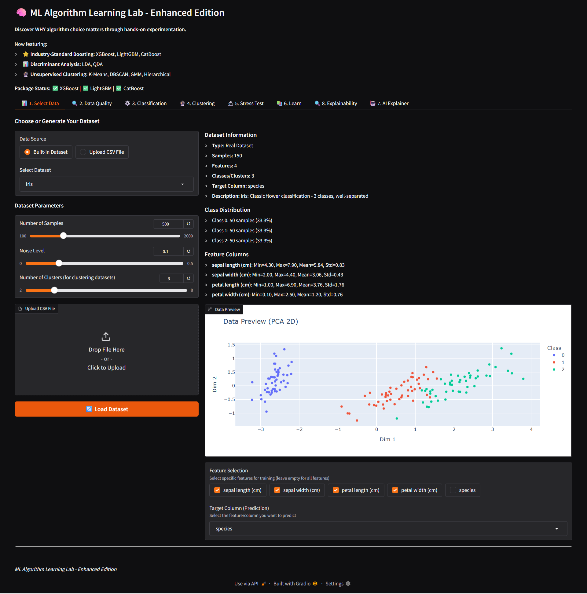
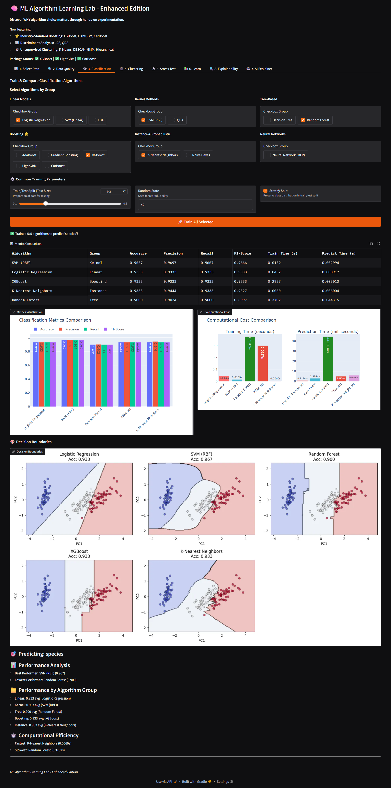
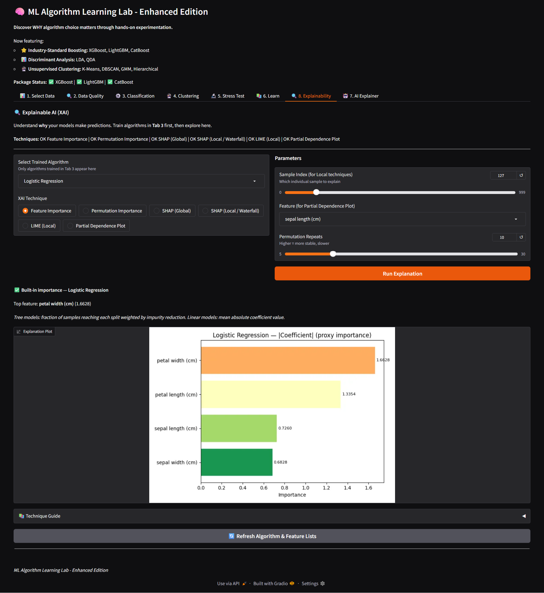

# ML Algorithm Learning Lab

An interactive machine learning experimentation platform that enables users to train, compare, visualize, and interpret multiple machine learning algorithms through a single web interface.

Built using Python, Gradio, Scikit-Learn, FastAPI, and Explainable AI frameworks.

## Why I Built This

Most machine learning tutorials focus on training a single model and viewing a few metrics. Beginners often struggle to understand:

- How different algorithms compare
- When one algorithm performs better than another
- How model predictions are made
- How explainability techniques work in practice

This project was created to provide a hands-on environment where users can experiment with multiple algorithms, visualize results, and understand model behavior through Explainable AI techniques.

## Core Features

### Multi-Algorithm Comparison

Train and compare multiple machine learning algorithms on the same dataset and evaluate:

- Accuracy
- Precision
- Recall
- F1 Score
- Confusion Matrix
- Decision Boundaries

### Clustering Playground

Experiment with unsupervised learning algorithms including:

- K-Means
- DBSCAN
- Hierarchical Clustering
- Spectral Clustering
- Gaussian Mixture Models

### Explainable AI Toolkit

Understand model predictions using:

- Feature Importance
- Permutation Importance
- SHAP
- LIME
- Partial Dependence Plots

### AI-Powered Insights

Generate natural language explanations that help users understand algorithm performance and model behavior.


## Screenshots

### Dashboard



### Algorithm Comparison



### SHAP Explanations




## Technology Stack

### Frontend
- Gradio

### Machine Learning
- Scikit-Learn
- XGBoost
- LightGBM
- CatBoost

### Explainable AI
- SHAP
- LIME

### Backend
- FastAPI

### Data Visualization
- Plotly
- Matplotlib


## Workflow

1. Select a dataset
2. Choose one or more algorithms
3. Train and compare models
4. Analyze performance metrics
5. Explore Explainable AI visualizations
6. Generate AI-powered explanations


## Challenges Solved

During development, several challenges were addressed:

- Supporting a large number of ML algorithms within a unified interface
- Designing reusable evaluation pipelines
- Integrating SHAP and LIME into a single workflow
- Handling optional dependencies gracefully
- Building an AI explanation layer that complements traditional ML metrics


## Quick Start

```bash
uv sync
uv run app26.py
```